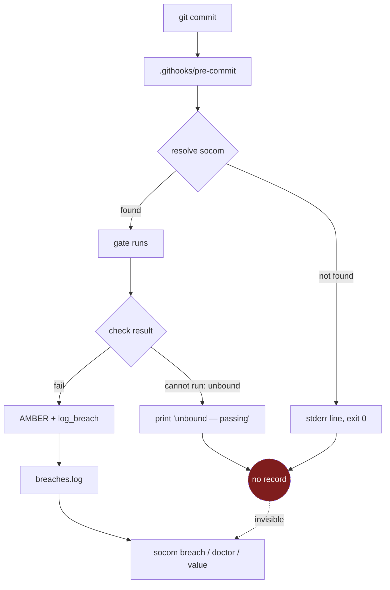
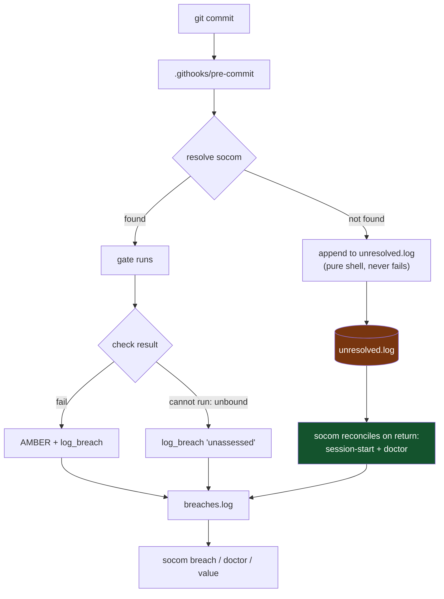

# 0002 — Unresolvable enforcement must record

**Status:** Proposed — **HELD AT THE GATE, not dispatch-ready** (Step 0b: the fix
mechanism is D0). Written 2026-08-05 against `caa677a`.
**Row:** [[DEF-UNRESOLVABLE-GATE-LEAVES-NO-TRACE-01]] (`buckets/defects.md`, READY P1).
**Governed by:** [`0001`](0001-exposure-before-capability.md) — this is a defect
design, not a capability, so it does not breach 0001 §Falsifiable acceptance.
Nothing here may be built before [[EV-NONAUTHOR-EXPOSURE-01]] has a result.

---

## Objective, in root form

**Eliminate the class "enforcement that degrades open without a trace" by making
*inability to assess* a recorded event — written at the one band that still
executes when socom does not, and reconciled when socom returns.**

Not: "make the symlink more robust." That is the instance.

---

## Step 0 — Data breakdown

Every load-bearing claim, tagged. A design sentence may rest only on `MEASURED`.

| # | Claim | Tag | Probe |
|---|---|---|---|
| 1 | An unreachable binary makes the hook `exit 0` and the commit proceeds | `MEASURED (n=1 A/B)` | throwaway repo, run B |
| 2 | Nothing is written anywhere in `.socom/` on that path | `MEASURED` | `breaches.log` 4→4; `find .socom -newermt '-20 seconds'` empty |
| 3 | The same repo, same check, **reachable**, does record | `MEASURED` | run A: `breaches.log` 2→4, `AMBER — breach logged` |
| 4 | `install` symlinks at the file you ran; `adopt` records that same path as `socom.binpath` — so both resolution tiers die together | `MEASURED` | `git config socom.binpath` = the deleted file |
| 5 | No socom detector can observe this state | `MEASURED` | run C: `doctor` → 5 findings, none about the 3 ungated commits |
| 6 | Drift in an **owned** referent *is* detected | `MEASURED` | same `doctor` run: compiled-view hash drift → P0 |
| 7 | `checks.* unbound` returns with no `log_breach` | `MEASURED` | `gate.py:297` vs `:312`; `log_breach` call sites enumerated |
| 8 | `spawn --exec` handles the same class loudly | `MEASURED` | `spawn.py:413` `sys.exit`; `install.py:200` preflight |
| 9 | Fail-open-locally is deliberate, not accidental | `MEASURED` | `canon/residuality.xml` `fail-safe-defaults` + `psychological-acceptability` |
| 10 | A malformed `socom.yaml` fails **closed** | `MEASURED` | repro: parse error, 0 commits landed — correct, not a defect |
| 11 | How often a real user's install actually dangles | **`UNMEASURED`** | needs non-author installs; naming it is the deliverable |
| 12 | Whether the shell-side append is reliable across shells/filesystems | **`UNMEASURED`** | the spike below |

Claim 11 is why the row is P1, not P0: the *frequency* is unknown and
unmeasurable without users. Claim 12 is why this decision is held — see Step 0b.

## Step 0b — Proof tier

Two different mechanisms, two different tiers. Conflating them is the trap.

| Mechanism | Tier | Basis |
|---|---|---|
| **The defect** — enforcement degrades open silently | 🟡 **D2 — PATH-PROVEN** | socom's own code, real execution, real repo, controlled A/B |
| **The fix** — shell-side trace + socom-side reconcile | 🔴 **D0 — ASSUMED** | not executed. Read, reasoned, never run |

**The fix mechanism is D0, and it introduces a format contract between a shell
writer and a Python reader. Per the gate: no contract above D1. This design is
therefore NOT dispatch-ready.**

The experiment that raises it, in full: add the append to a hook in the throwaway
repo, break resolution, commit, confirm the line lands; then confirm the hook
still exits 0 when the log path is unwritable (read-only `.socom`, missing
parent, full disk simulated via a bad path). Cost: under an hour. **It does not
run before [[EV-NONAUTHOR-EXPOSURE-01]].**

## Step 1 — Blast-radius triage

**Answer: YES — high blast radius.** It edits `HOOK_TEMPLATES`, which lands in
the pre-commit / commit-msg / pre-push path of **every adopted repo**. A defect
there breaks the user's `git commit`. It is also a pattern others will copy, and
it outlives the finding that prompted it.

The ordered design gate is therefore mandatory. Stages 1–4 below were produced
**before** the path was chosen; stages 5–7 sit under Lens 5.

### Stage 1 — Problem isolation (probe evidence, not inference)

Root cause pinned: `HOOK_RESOLVER` (`src/socom/gate.py`) walks three tiers —
`command -v socom` → `git config socom.binpath` → `$SOCOM_HOME/bin/socom` — and
on total failure prints one stderr line and `exit 0`. The declaration that
summoned it (`core.hooksPath=.githooks`) is untouched and durable.

Mechanism of the silence: the trace would have to be written by socom, and socom
is the thing that is absent. **A self-hosted detector cannot detect its own
absence.** Run C is the direct evidence.

### Stage 2 — Diagram

Current broken state:



Target state:



The single structural change: **the trace is written by the code that is still
running when socom is not.**

### Stage 3 — Scope

**Changes:**
- `HOOK_RESOLVER` — one append before the existing `exit 0`
- `gate.py:297` — `log_breach` on the unbound-check path
- a reconciler, invoked from `gate session-start` and `doctor`
- `doctor` — detect hooks planted from a pre-change template (contagion, below)
- tests for each; `PILOT.md` safety section

**Explicitly NOT changing:**
- the symlink (instance, not class — `install` stays as-is)
- the fail-open posture (deliberate doctrine; see Lens 2 Q2)
- `unadopt` / `uninstall` semantics
- anything under `bin/socom` by hand — it is built from `src/`

### Stage 4 — Risk / blast radius per candidate

| # | Candidate | Failure modes | Blast radius | Reversibility | Verdict |
|---|---|---|---|---|---|
| A | symlink → copy | staleness; PATH still breaks for other reasons | low | trivial | **Rejected** — instance, not class (Lens 1 Q3) |
| B | fail closed when unresolvable | blocks `git commit` on a missing tool; users `--no-verify` permanently | **very high** | easy to revert, impossible to un-teach | **Rejected** — inverts `psychological-acceptability` |
| C | detector inside socom only | fires only when socom runs — i.e. never in the failing state | none | trivial | **Rejected — MEASURED dead** (run C) |
| D | shell-side trace + socom-side reconcile | a bad shell line breaks every commit in every adopted repo | **high at U1**, low elsewhere | fully reversible | **Chosen**, with U1 bound |
| E | sequenced records — a gap is a positive signal | a format contract on durable records, cut at D0; migration of existing records | medium, but **one-way** on the record format | hard — records already written cannot be retro-sequenced | **OPTION, not chosen** — see below; D1 cap binds |

**Future-session blast radius:** already-adopted repos keep their old hook
scripts until re-adopted. A later session reading "the trace is recorded" will be
wrong for every repo adopted before this lands. That is the contagion row below,
and it is the part most likely to be dropped.

#### Candidate E — sequenced records (OPTION, recorded 2026-08-05, not chosen)

**The idea:** give every append-only record class a monotonic sequence (or a hash
chain to its predecessor) so that a **missing** record is a positive signal rather
than an absence.

**Why it is not a restatement of D.** D records the breach on the **writer**
side — and `log_breach` (`core.py:94`) writes `.socom/gates/breaches.log`, a
**local** file. The party that needs to know is a different session on a different
machine, which never sees it. E is the only candidate here that acts on the
**reader** side, which is the half a local log structurally cannot reach.

**The failure it targets, stated precisely.** A hash detects **modification**. It
cannot detect **omission** — there is nothing to hash. `tests/ledgercheck.py` has
the same blind spot by construction: it validates the shape of every row present
and is incapable of noticing a row that is not. Same for `bb_fetch`, which fails
OPEN, so *"no leases held"* and *"I could not fetch"* are the same value. A
sequence converts "I got nothing" into "I got a gap between 7 and 9" — a
**detectable** breach, which is `compromise-recording` (`canon/residuality.xml:95-99`)
doing its job instead of being violated.

**Precedent, in-repo.** socom already runs the *modification* half of this idea and
it works: `canonical_hash()` (`core.py:111`) hashes the canon + `socom.yaml`, the
compiled view carries `source=<hash>`, and `gate session-start` / `precond`
recompute and compare (`gate.py:216`, `lifecycle.py:784`) — emitting
`P0 DRIFT — compiled views stale`. The pattern is proven here. It is simply not
generalized to the ledger, the blackboard shards, or findings, and the canon case
is the easy one: **both sides are local**, so nothing has to survive a remote.

**Precedent, outside.** Two independent standards bodies converged on sequence as
the omission-detector: SCITT's ledger is a linear, irrevocable statement sequence,
and TUF §5.4.3.1 requires the timestamp version to strictly increase. Per
`decisions/0003` **neither is adopted** and neither should be cited as a reason to
build — but the convergence is evidence about the *shape*, which is worth having.

**Why it stays an option and is not chosen.**
- It is a **format contract on durable records** cut at proof tier **D0** — exactly
  what the D1 cap in Step 0b exists to prevent. Candidate D is bounded by a U1
  spike; E has had no spike at all.
- It is the **least reversible** candidate in the table. Records already written
  cannot be retro-sequenced, so a wrong sequence design is inherited permanently by
  every record that follows it.
- It solves a defect (`DEF-BLACKBOARD-GRANTS-ON-UNREACHABLE-REMOTE-01`) whose own
  verification needs **two concurrent sessions**, which have never been run.

**What the spike must now weigh.** The Step 0b spike question was sharpened on
2026-08-05 to: *can the writer half ship alone, or does a durable `published` flag
force the reader-side join immediately?* E supplies a second answer to that
question — if the reader-side join is forced anyway, a sequence may be **cheaper
and more honest** than a provisional-flag patch, because it fixes detection rather
than annotating it. Weigh D-with-flag against E on that axis. **Do not build
either before U1.**

---

## Lens 1 — Root vs conformity vs convenience

1. **Conformity?** No — the chosen design *breaks* symmetry with the neighbouring
   fail-open sites. If nothing existed to match, this is still the design: the
   recorder must outlive the recorded.
2. **Convenience?** The convenient fix is candidate A (one line, ships today). It
   is rejected explicitly. The chosen path costs a spike and a contagion sweep.
3. **Visible slice?** Swept — three instances tabled in the row, plus the
   contrasting owned-referent case that establishes the boundary. The sweep found
   `gate.py:297`, which was not the instance I started from.

**Clean.**

## Lens 2 — Residuality gate

| Q | Answer |
|---|---|
| **Symptom vs root** | Root. The symptom is a dangling symlink; the class is unrecorded inability-to-assess. |
| **Stress relocation** | **None.** The stress (an unobservable state) is *removed* — it becomes observable. No new pressure point; `breaches.log` already exists with a close-loop (`socom breach resolve`). The four relocation conditions are not invoked because nothing is relocated. |
| **Hidden quantitative assumption** | **One, surfaced:** `unresolved.log` grows one line per hook invocation while socom is away, and is truncated by reconcile. A repo where socom never returns grows it unboundedly. Stated, not buffered away: that repo is ungated anyway, and the file is one short line per commit. No cap is added, because a cap would silently discard the evidence this design exists to keep. |
| **Class sweep** | Three instances tabled; one contrast case proves the boundary. `spawn --exec` already handles the class correctly and is the precedent. |
| **Reversibility / regret** | Fully reversible. No schema, no migration, no wire format beyond a machine-local TSV that reconcile consumes and truncates. |
| **Falsifiable proof** | Re-run the A/B; run B must surface the ungated window after the binary returns. Stated as an acceptance test, not a claim. |

**Verdict: RESIDUAL.**

## Lens 3 — Capability, composability & criticality

**Capability decomposition** — four units, each independently deliverable:

| Unit | Capability | Standalone? |
|---|---|---|
| U1 | Hook records unresolvable invocations | Yes — the log accumulates and is readable by `cat` alone |
| U2 | socom reconciles the log into breach rows on return | Yes — no-op when the log is absent |
| U3 | Unbound-check path logs a breach (`gate.py:297`) | Yes — independent of U1/U2 |
| U4 | `doctor` detects pre-change hook templates | Yes |

**Composability:** U1 without U2 is fail-closed-until-composed in the right
direction — the evidence exists and is human-readable, it is simply not yet
promoted into `breach`. U2 without U1 is a harmless no-op. **The seam is
factored, not instanced:** U2 reconciles *a log of unassessable events*, which is
why U3 writes through the same `log_breach` sink rather than growing a parallel
path.

**Criticality index — the go/no-go band:**

| Unit | Tier | Why | Binding |
|---|---|---|---|
| **U1** | 🟡 **C1** | Runs in the hot path of every git operation in every adopted repo. A shell error breaks the user's commit. | **Code-time binding named:** the append must be unconditionally non-failing (`>> … 2>/dev/null || true`) **and** a test must assert the hook still exits 0 with `.socom` unwritable / absent. Without that test U1 is not dispatchable. |
| U2 | 🟢 C2 | Read-and-convert on a path socom already owns | wave-close assertion |
| U3 | 🟢 C2 | One `log_breach` call on an existing branch | unit test |
| U4 | 🟢 C3 | Advisory `doctor` row | filed row |

**Zero open C0.** U1 lands AMBER with its binding named — dispatchable only with
that test. **Band: AMBER, not GREEN** — permitted, but the binding is not
optional.

**Contagion map** — what else moves when this lands:

| Item | Direct blast (crit) | Contagion — what else must move |
|---|---|---|
| `HOOK_RESOLVER` change | C1 | **Every already-adopted repo keeps its old hooks** until re-adopted/recompiled → U4 must detect and say so. Swept: `HOOK_TEMPLATES`/`HOOK_RESOLVER` have exactly one writer (`_wire_hooks`) and one session-start variant — both must change together. |
| `gate.py:297` → logs | C2 | `value.py:_val_gate_catches` counts `breaches.log` lines and calls them *"slips stopped"*. Adding a new **unassessed** class makes that label wronger. Overlaps [[DEF-STATUS-CLAIMS-UNLABELLED-01]] — must be sequenced after it, or the metric degrades. **Not "none."** |
| `unresolved.log` | C2 | Must be inside the `# >>> socom` `.gitignore` block — it is machine-local. Verified the block mechanism exists (`_ensure_ignore_block`). |
| `PILOT.md` safety claims | C3 | The "there is a way back" section gains a true statement about detection. |

**Verdict: COMPOSABLE, landing AMBER on U1 with its binding named.**

## Lens 4 — Evolvability

A contract exists (the `unresolved.log` line format, written by shell, read by
Python), so the lens applies.

1. **Axes of change:** more unassessable sites (future gates, other bands); other
   writers (a CI shim); richer context per event (which gate, which repo state).
2. **Each axis lands at a seam:** a new unassessable site appends the same line
   shape; the reconciler is untouched. No ripple into the gate core.
3. **Superset-not-snapshot:** validated against the *second* implementation now —
   U3 (`checks.* unbound`) is a different writer with a different cause, and it
   fits the same line without reshaping. That is the check this lens asks for,
   and it passed against a real second case rather than an imagined one. Format
   mirrors `breaches.log` (`ts \t source \t detail`) so reconcile is a re-tag,
   not a translation.
4. **No premature generality:** no config knob, no pluggable sink, no severity
   taxonomy. Each is an axis nobody named.

**Verdict: EVOLVABLE.**

## Lens 5 — Contract & coverage

Multi-layer by the gate's test (shell + Python + tests + docs + a machine-local
artifact), so the inventory is required rather than N/A.

**Layer inventory:**

| Layer | Present | Item |
|---|---|---|
| Migration | N/A — no schema | — |
| Core / shell | ✅ | `HOOK_RESOLVER` append (U1) |
| Storage | ✅ | `.socom/gates/unresolved.log`, gitignored |
| Services | ✅ | reconciler (U2) |
| Gate surface | ✅ | `gate.py:297` (U3), `gate session-start` |
| Diagnostics | ✅ | `doctor` reconcile + template detection (U4) |
| CLI | ✅ | surfaces through existing `socom breach` — no new verb |
| Observability | ✅ | breach rows feed the existing close-loop |
| Tests | ✅ | see stage 7 |
| Docs | ✅ | `PILOT.md` §Is it safe? |
| Build | ✅ | `python3 build.py` + `--check` (source is `src/`, never `bin/`) |

**Decision → surface map:** the governing clause is
`canon/residuality.xml` `compromise-recording` — *"Fail it when a fail-open path
leaves no trace."* Mapped: U1 (unreachable), U3 (unbound). **Unmapped clause:**
`uninstall` without `unadopt` leaves every adopted repo ungated and is currently
a printed NOTE. Not covered by U1–U4 — **filed as an explicit C3 deferral**, not
silently scoped out.

**Stressor → acceptance map:** each stressor from Lens 2 has a named test in
stage 7 below.

**Completeness critic** — what is missing:
- The reconciler attributes an ungated window to a *time range*, not to specific
  commits. Naming the commits would need the hook to record `HEAD`, which it can.
  **Open question for the spike**, not assumed either way.
- CI cannot assert this: the failure is local-only by construction. The "CI
  re-asserts" claim in the stderr line remains unverified for repos without CI —
  U4 should check whether CI exists before printing it. **Added as a finding.**

### Stage 5 — Contract (machine-checkable end state)

```yaml
contract: unresolvable-enforcement-must-record
assertions:
  - id: A1
    given: adopted repo, checks.medium bound and failing, socom unreachable
    then: .socom/gates/unresolved.log gains exactly one line per hook invocation
    probe: "wc -l unresolved.log before/after one commit"
  - id: A2
    given: the same, with .socom read-only or absent
    then: the hook still exits 0 and git commit succeeds
    probe: "chmod a-w .socom; git commit; echo $?"
    binds: U1-C1
  - id: A3
    given: socom becomes reachable again
    then: session-start and doctor name the count and time window of ungated
          invocations, and unresolved.log is truncated
    probe: "socom doctor | grep -c 'ungated'"
  - id: A4
    given: checks.medium unbound
    then: a breach row is written with an 'unassessed' detail
    probe: "grep unassessed breaches.log"
  - id: A5
    given: a repo adopted before this change
    then: doctor reports its hooks predate the recording template
    probe: "socom doctor | grep 'hooks predate'"
  - id: A6
    given: any of the above
    then: bin/socom is rebuilt from src/ and build.py --check is clean
    probe: "python3 build.py --check"
```

### Stage 6 — Implementation design, with rollback per step

| # | Step | Rollback |
|---|---|---|
| 1 | **Spike U1 only** in a throwaway repo — raise the fix mechanism D0 → D2 | delete the throwaway |
| 2 | U3 (`gate.py:297` → `log_breach`) — smallest, independent, no shell | revert one line |
| 3 | U1 with its C1 binding test (A2) written **first** | revert `HOOK_RESOLVER`; old hooks keep working — the change is additive to a path that already exits 0 |
| 4 | U2 reconciler, wired into `session-start` + `doctor` | revert; `unresolved.log` becomes inert text |
| 5 | U4 template detection + the CI-existence check | revert; advisory only |
| 6 | `PILOT.md`, `build.py`, `gate full` | revert doc commit |

Each step is its own commit. Steps 2–5 are independently revertible; none
depends on a later one being present.

### Stage 7 — Expected behavioral units

Not "the log exists" — what must be observably true, phrased so it can fail:

| Impl unit | Expected behavior (falsifiable) | Test |
|---|---|---|
| U1 | Run B of the row's A/B produces a non-empty `unresolved.log` where it currently produces nothing | A1 |
| U1 | With `.socom` unwritable, `git commit` exit code is unchanged from today | A2 |
| U2 | After the binary returns, a socom surface states a **count** and a **time window** — not merely "something happened" | A3 |
| U3 | An unbound check produces a breach row distinguishable from a *failed* check | A4 |
| U4 | A repo adopted at `caa677a` is reported as pre-change | A5 |
| all | `gate full`, `unit.py`, `build.py --check` green **after** the last edit | A6 |

**Verdict: COVERED**, with one explicit C3 deferral (`uninstall`/`unadopt`) and
two open questions routed to the spike.

## Lens 6 — Verifier agents

**N/A — with reason, not skipped.** The repo's verifier roster (`ferris` Rust,
`aegis` K8s/Helm, `pixel` portal) has no lens that fits a Python CLI plus shell.
socom's own `reviewer` seat is the right reader, and it is dispatched at
implementation time — which is after the exposure run, not now. **Named
explicitly so it is not silently dropped:** nothing here has been reviewed by an
independent reader, and the design should not be treated as verified.

---

## Combined verdict

**HELD — not dispatch-ready.** Blocking, most severe first:

1. **Step 0b: the fix mechanism is D0.** The defect is D2; the repair is not. A
   format contract between a shell writer and a Python reader may not be cut
   above D1. → spike U1 first.
2. **Lens 3: U1 lands AMBER (C1)**, dispatchable only with the A2 test named and
   written first.
3. **Decision 0001 §Falsifiable acceptance** bars building until
   [[EV-NONAUTHOR-EXPOSURE-01]] has a result. This document is a design and a
   filed row — neither is a capability — so writing it is compliant. Building it
   is not.

Everything else passes: Step 0 grounded (12 claims, 10 MEASURED, 2 UNMEASURED and
named), Step 1 artifacts produced before the path was chosen, Lens 1 clean, Lens
2 RESIDUAL, Lens 3 COMPOSABLE / AMBER-bound / zero C0, Lens 4 EVOLVABLE, Lens 5
COVERED.

**Next action is not "implement carefully."** It is the one-hour U1 spike — and
it does not run before the exposure.

---

## Appendix — full codebase class sweep (2026-08-05, `caa677a`, 6915 lines)

Swept every site matching condition (2) of the class — resolution through an
unowned referent — and rated each on (3), the degrade. Two axes, and they are
independent: **A** = unowned referent, **B** = degrades open with no durable
trace. The strict class is A∧B.

### Instances — A∧B

| # | Site | Unowned referent | Degrade | Filed |
|---|---|---|---|---|
| 1 | `HOOK_RESOLVER` (`lifecycle.py:244`) | the socom binary on PATH | `exit 0`, stderr only | [[DEF-UNRESOLVABLE-GATE-LEAVES-NO-TRACE-01]] |
| 2 | `gate.py:297` | the user's check command binding | *"unbound — passing"*, no `log_breach` | same row |
| 3 | **`bb_do_claim` (`blackboard.py:485`)** | **the git remote** | **grants; record has no `published` field** | **[[DEF-BLACKBOARD-GRANTS-ON-UNREACHABLE-REMOTE-01]]** |
| 4 | `bb_do_attest` | the git remote | records `(verified)`; peer sees `0 outstanding` | same row |
| 5 | `mcp.py:218` | the git remote | returns `granted: true`, `isError: false` | same row |
| 6 | `uninstall` without `unadopt` (`install.py`) | every adopted repo's hooks | printed NOTE, enforces nothing | row 1, C3 deferral |

Instances 3–5 were found by this sweep and are **more severe than the instance
that prompted it**: a lease's whole function is inter-session visibility, so a
local-only lease is not degraded — it is a no-op reporting success.

### Checked and clean — the class does NOT apply

Recorded so a later session does not re-sweep them.

| Site | Why clean |
|---|---|
| `import yaml` (`core.py:19`), `import fcntl` (`ledger.py:108`, `spawn.py:244`) | `sys.exit` with a named remedy — loud, R6-compliant |
| `contract verify` (`ledger.py:228+`) | an unrunnable check returns non-zero → `FAIL`. **Fails closed**, the inverse of instance 2 |
| `contract adequacy` | actively defends the *inverse* defect — flags a contract whose green verify would prove nothing |
| malformed `socom.yaml` | **MEASURED**: parse error, 0 commits landed. Fails closed |
| `spawn --exec` missing runtime (`spawn.py:413`) | `sys.exit` "R6: degrade loudly", plus `_runtime_preflight` (`install.py:200`) surfaces it at onboarding. **This is the precedent the instances above should follow** |
| `query` vector index absent (`retrieval.py:252`) | prints the degrade **and** the L0 keyword floor is mandatory and functional — a real fallback, not a skip |

### Bounded residue — known, documented, not silent

| Site | Status |
|---|---|
| `_pid_alive` cross-host (`monarch.py:37-44`) | The pid ambiguity is named in a comment and mitigated by `RUN_STALE_HOURS = 72`; reaps log a breach (`monarch.py:178,295`). Run records carry **no host field**, so within the horizon a coincidental pid match on another host reads "running". Bounded and traced — not an instance, but the horizon is the only thing holding it. |
| `bb_expired` unparseable → `True` (`blackboard.py:139`) | Fails **open** on collision prevention (a corrupt lease record is dropped, so a conflicting claim is granted) and logs nothing — condition **B without A**, since the record is socom-owned and therefore *detectable*. Below the filing bar alone; would be swept up by the same "record what you could not assess" rule. |

### What the sweep changes about the design

Nothing structural — instances 3–5 share the class and the fix shape (*record
what you could not assess; reconcile when the referent returns*), but they need
their own repair, because the durable marker belongs **on the record** (a
`published` field) rather than in a side log, and because the **fetch** failure
must be reported distinctly from the **push** failure. That is scoped in
[[DEF-BLACKBOARD-GRANTS-ON-UNREACHABLE-REMOTE-01]], not here. This document
remains the gate-path design.

## Alternatives rejected

Candidates A (symlink→copy), B (fail closed) and C (in-socom detector) are tabled
with reasons at Stage 4. C is worth restating because it is the one that looks
obviously right and is **measurably dead**: a detector inside socom cannot
observe socom's own absence, and run C demonstrates `doctor` reporting five
findings while three ungated commits sat in the same repo's log.
